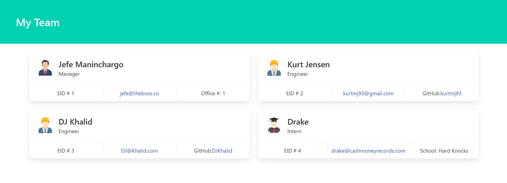

# OOP Team Profiles

  

  

  ## Description

  Uses Nodejs and inquirer to prompt user for team member information, then generates an attractive and responsive HTML file with cards containing team members information. Includes classes and constructors, etc.

  ### User Story
> AS A manager  
> I WANT to generate a webpage that displays my team's basic info  
> SO THAT I have quick access to their emails and GitHub profiles

### Acceptance Criteria
> GIVEN a command-line application that accepts user input  
> WHEN I am prompted for my team members and their information  
> THEN an HTML file is generated that displays a nicely formatted team roster based on user input  
> WHEN I click on an email address in the HTML  
> THEN my default email program opens and populates the TO field of the email with the address  
> WHEN I click on the GitHub username  
> THEN that GitHub profile opens in a new tab  
> WHEN I start the application  
> THEN I am prompted to enter the team manager’s name, employee ID, email address, and office number  
> WHEN I enter the team manager’s name, employee ID, email address, and office number  
> THEN I am presented with a menu with the option to add an engineer or an intern or to finish building my team  
> WHEN I select the engineer option  
> THEN I am prompted to enter the engineer’s name, ID, email, and GitHub username, and I am taken back to the menu  
> WHEN I select the intern option  
> THEN I am prompted to enter the intern’s name, ID, email, and school, and I am taken back to the menu  
> WHEN I decide to finish building my team  
> THEN I exit the application, and the HTML is generated  

  ## Table of Contents

  - [Installation](#installation)
  - [Usage](#usage)
  - [Tests](#tests)
  - [Contributing](#contributing)
  - [Credits](#credits)
  - [License](#license)
  - [Questions](#questions)

  ## Installation

  requires node, inquirer @8.2.4 and jest for test suite

  ## Usage

  run via command line: node index.js

  video of the application in action: [Usage Video](https://github.com/Kurtmj93/)

  ## Tests

  run npm test via command line

  ## Contributing

  don't go it alone - hire me

  ## Credits

  uses Bulma framework - thanks Bulma!

  ## License
    
    This project is licensed under the MIT license.

  ## Questions

  - [GitHub User: Kurtmj93](https://github.com/Kurtmj93/)
  - Email: Kurtmj93@gmail.com